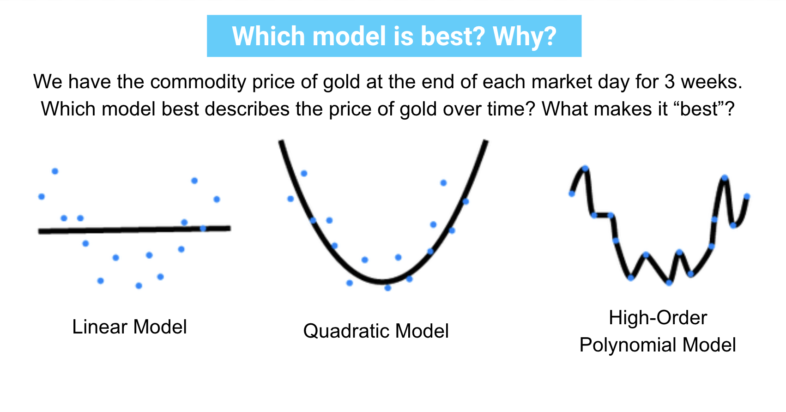
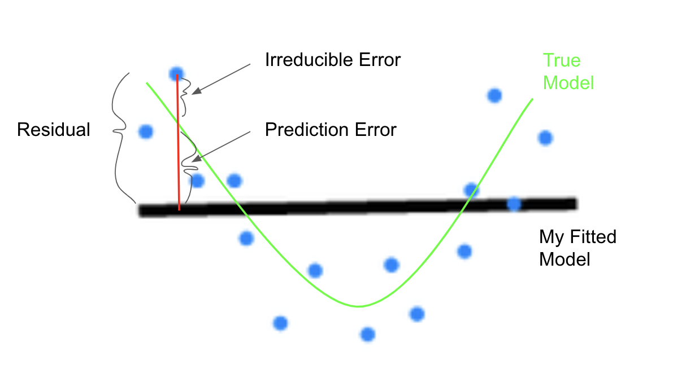
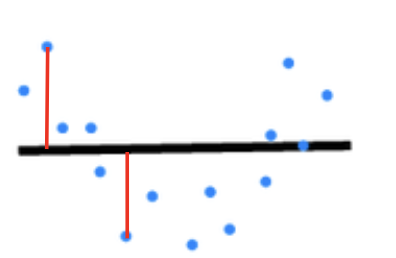
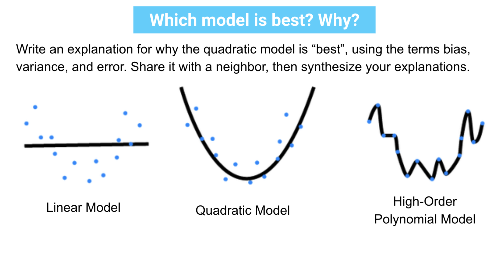

# Bias-Variance Tradeoff


## Agenda

1. Explain what bias, variance, and error are in the context of statistical modeling
2. Explain how bias, variance and error are related via the bias-variance tradeoff
3. Explain how a holdout set can be used to evaluate a model
4. Use a test set to estimate model bias, variance and error


# 1. Explain what bias, variance, and error are in the context of statistical modeling



https://towardsdatascience.com/cultural-overfitting-and-underfitting-or-why-the-netflix-culture-wont-work-in-your-company-af2a62e41288


# What makes a model good?

- We don’t ultimately care about how well your model fits your data.

- What we really care about is how well your model describes the process that generated your data.

- Why? Because the data set you have is but one sample from a universe of possible data sets, and you want a model that would work for any data set from that universe

# What is a “Model”?

 - A “model” is a general specification of relationships among variables and parameters.
E.G. Linear regression, or 

$$\Large Price = \beta_1 X_1 + \beta_0 + \epsilon$$

 - A “trained model” is a particular model with parameters estimated using some training data.


# Remember Expected Value?

- The expected value of a quantity is the weighted average of that quantity across all possible samples


- The expected value of a 6-sided die is:

Suppose we created a model which always predicted that the die roll would be 3.

The **bias** of our model would be the difference between the our expected prediction (3) and the expected value (3.5).

What would the **variance** of our model be?


# Defining Error

There are 3 types of prediction error: bias, variance, and irreducible error.

$Total Error = Prediction\ Error+ Irreducible\ Error$



$Total Error = Residual = Prediction\ Error+ Irreducible\ Error$
> For regression, “error” usually refers to prediction error or to residuals <br>Prediction errors are approximated by residuals

### Regression fit statistics are often called “error”
 - Sum of Squared Errors (SSE)
 - Mean Squared Error (MSE) 
     - Calculated using residuals




# 2. Explain how bias, variance and error are related via the bias-variance tradeoff


**Let's do a thought experiment:**

1. Imagine you've collected 5 different training sets for the same problem.
2. Now imagine using one algorithm to train 5 models, one for each of your training sets.
3. Bias vs. variance refers to the accuracy vs. consistency of the models trained by your algorithm.


http://scott.fortmann-roe.com/docs/BiasVariance.html

# Defining Model Bias and Variance

**Model Bias** is the expected prediction error from your expected trained model

**Model Variance** is the expected variation in predictions, relative to your expected trained model

**High bias** algorithms tend to be less complex, with simple or rigid underlying structure.

+ They train models that are consistent, but inaccurate on average.
+ These include linear or parametric algorithms such as regression and naive Bayes.

On the other hand, **high variance** algorithms tend to be more complex, with flexible underlying structure.

+ They train models that are accurate on average, but inconsistent.
+ These include non-linear or non-parametric algorithms such as decision trees and nearest neighbors.

### Let's take a look at our familiar King County housing data. 

$\Large Total Error = Model\ Bias^2 + Model\ Variance + Irreducible\ Error$


http://scott.fortmann-roe.com/docs/BiasVariance.html



# Train Test Split

It is hard to know if your model is too simple or complex by just using it on training data.

We can hold out part of our training sample, and use it as a test sample and use it to monitor our prediction error.

This allows us to evaluate whether our model has the right balance of bias/variance. 


* **training set** —a subset to train a model.
* **test set**—a subset to test the trained model.


### Should you ever train on your test set?  


**Never train on test data.** If you are seeing surprisingly good results on your evaluation metrics, it might be a sign that you are accidentally training on the test set. 

##### [Link](https://datascience.stackexchange.com/questions/38395/standardscaler-before-and-after-splitting-data) about data leakage and scalars

**How do we know if our model is overfitting or underfitting?**


If our model is not performing well on the training  data, we are probably underfitting it.  


To know if our  model is overfitting the data, we need  to test our model on unseen data. 
We then measure our performance on the unseen data. 

If the model performs way worse on the  unseen data, it is probably  overfitting the data.


Let's go back to our KC housing data without the polynomial transformation.

Now, we create a train-test split via the sklearn model selection package.

A .65 R-squared reflects a model that explains a fairly high amount of the total variance in the data. 

### Knowledge check
How would you describe the bias of the model based on the above training R^2?


```python
"A model with a .65 R^2 is approaching a low bias model."
```


    'A model with a .65 R^2 is approaching a low bias model.'


Next, we test how well the model performs on the unseen test data. Remember, we do not fit the model again. The model has calculated the optimal parameters learning from the training set.  


The difference between the train and test scores are low.

What does that indicate about variance?


```python
'The model has low variance'
```


    'The model has low variance'


# Now, let's try the same thing with our complex, polynomial model.

# Kfolds 


[image via sklearn](https://scikit-learn.org/stable/modules/cross_validation.html)

In this process, we split the dataset into train and test as usual, then we perform a shuffling train test split on the train set.  

KFolds holds out one fraction of the dataset, trains on the larger fraction, then calculates a test score on the held out set.  It repeats this process until each group has served as the test set.

We tune our parameters on the training set using kfolds, then validate on the test data.  This allows us to build our model and check to see if it is overfit without touching the test data set.  This protects our model from bias.

Once we have an acceptable model, we train our model on the entire training set, and score on the test to validate.


