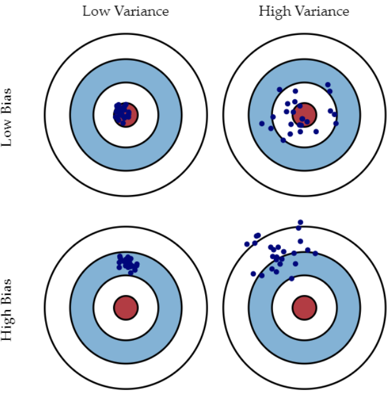

# Bias-Variance Tradeoff


## Agenda

1. Explain what bias, variance, and error are in the context of statistical modeling
2. Explain how bias, variance and error are related via the bias-variance tradeoff
3. Explain how a holdout set can be used to evaluate a model
4. Use a test set to estimate model bias, variance and error


[Bias_variance_tradeoff_deck](https://docs.google.com/presentation/d/1Rg-HiuxSQhegK6TFFwmdfhLDjGU8JLd0PxOhGk0zYNU/edit#slide=id.g5ca96dca77_1_0)

# 1. Explain what bias, variance, and error are in the context of statistical modeling


https://towardsdatascience.com/cultural-overfitting-and-underfitting-or-why-the-netflix-culture-wont-work-in-your-company-af2a62e41288


# What makes a model good?

- We don’t ultimately care about how well your model fits your data.

- What we really care about is how well your model describes the process that generated your data.

- Why? Because the data set you have is but one sample from a universe of possible data sets, and you want a model that would work for any data set from that universe

# What is a “Model”?

 - A “model” is a general specification of relationships among variables and parameters.
E.G. Linear regression, or 

$$\Large Price = \beta_1 X_1 + \beta_0 + \epsilon$$

 - A “trained model” is a particular model with parameters estimated using some training data.


# Remember Expected Value?

- The expected value of a quantity is the weighted average of that quantity across all possible samples


- The expected value of a 6-sided die is:


```python
probs = 1/6
rolls = range(1,7)

expected_value = sum([probs * roll for roll in rolls])
expected_value

```


    3.5


Suppose we created a model which always predicted that the die roll would be 3.

The **bias** of our model would be the difference between the our expected prediction (3) and the expected value (3.5).

What would the **variance** of our model be?


# Defining Error

There are 3 types of prediction error: bias, variance, and irreducible error.

$Total Error = Prediction\ Error+ Irreducible\ Error$


$Total Error = Residual = Prediction\ Error+ Irreducible\ Error$
> For regression, “error” usually refers to prediction error or to residuals <br>Prediction errors are approximated by residuals

### Regression fit statistics are often called “error”
 - Sum of Squared Errors (SSE)
 - Mean Squared Error (MSE) 
     - Calculated using residuals


# 2. Explain how bias, variance and error are related via the bias-variance tradeoff


**Let's do a thought experiment:**

1. Imagine you've collected 5 different training sets for the same problem.
2. Now imagine using one algorithm to train 5 models, one for each of your training sets.
3. Bias vs. variance refers to the accuracy vs. consistency of the models trained by your algorithm.



http://scott.fortmann-roe.com/docs/BiasVariance.html

# Defining Model Bias and Variance

**Model Bias** is the expected prediction error from your expected trained model

**Model Variance** is the expected variation in predictions, relative to your expected trained model

**High bias** algorithms tend to be less complex, with simple or rigid underlying structure.

+ They train models that are consistent, but inaccurate on average.
+ These include linear or parametric algorithms such as regression and naive Bayes.

On the other hand, **high variance** algorithms tend to be more complex, with flexible underlying structure.

+ They train models that are accurate on average, but inconsistent.
+ These include non-linear or non-parametric algorithms such as decision trees and nearest neighbors.

$\Large Total Error = Model\ Bias^2 + Model\ Variance + Irreducible\ Error$


http://scott.fortmann-roe.com/docs/BiasVariance.html


# 1. Explain what bias, variance, and error are in the context of statistical modeling

There are 3 types of prediction error: bias, variance, and irreducible error.


**Total Error = Bias + Variance + Irreducible Error**

### The Bias-Variance Tradeoff


**Let's do a thought experiment:**

1. Imagine you've collected 5 different training sets for the same problem.
2. Now imagine using one algorithm to train 5 models, one for each of your training sets.
3. Bias vs. variance refers to the accuracy vs. consistency of the models trained by your algorithm.


**High bias** algorithms tend to be less complex, with simple or rigid underlying structure.

+ They train models that are consistent, but inaccurate on average.
+ These include linear or parametric algorithms such as regression and naive Bayes.

On the other hand, **high variance** algorithms tend to be more complex, with flexible underlying structure.

+ They train models that are accurate on average, but inconsistent.
+ These include non-linear or non-parametric algorithms such as decision trees and nearest neighbors.

# Train Test Split

**How do we know if our model is overfitting or underfitting?**


If our model is not performing well on the training  data, we are probably underfitting it.  


To know if our  model is overfitting the data, we need  to test our model on unseen data. 
We then measure our performance on the unseen data. 

If the model performs way worse on the  unseen data, it is probably  overfitting the data.

The previous module introduced the idea of dividing your data set into two subsets:

* **training set** —a subset to train a model.
* **test set**—a subset to test the trained model.

You could imagine slicing the single data set as follows:


**Never train on test data.** If you are seeing surprisingly good results on your evaluation metrics, it might be a sign that you are accidentally training on the test set. 


```python

```
